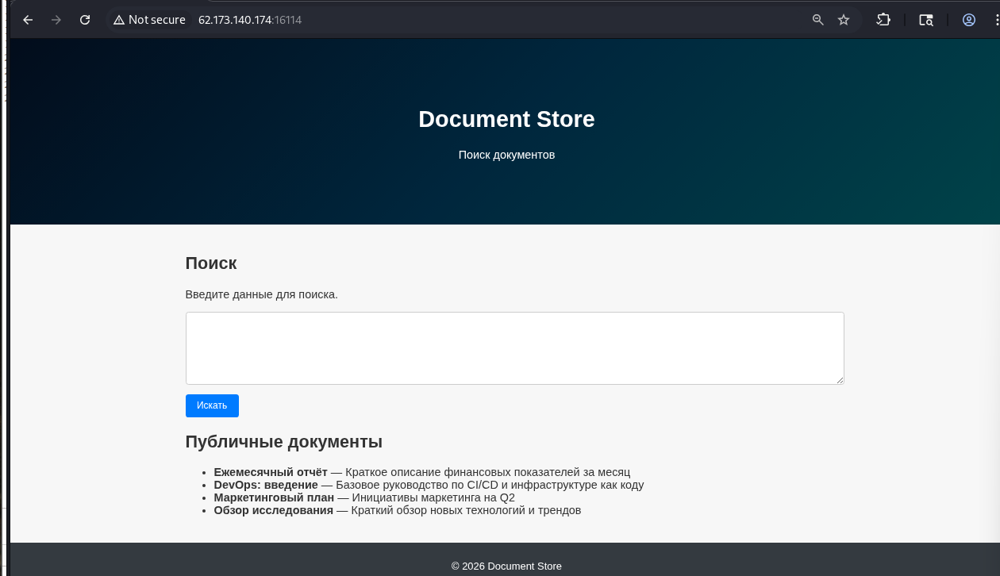
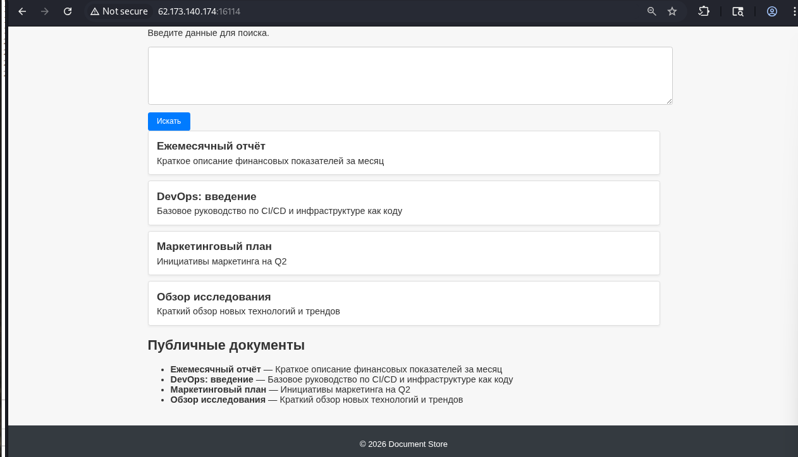
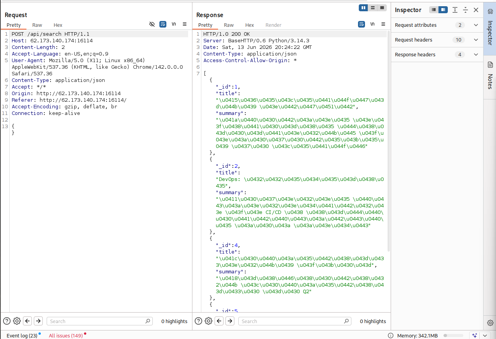
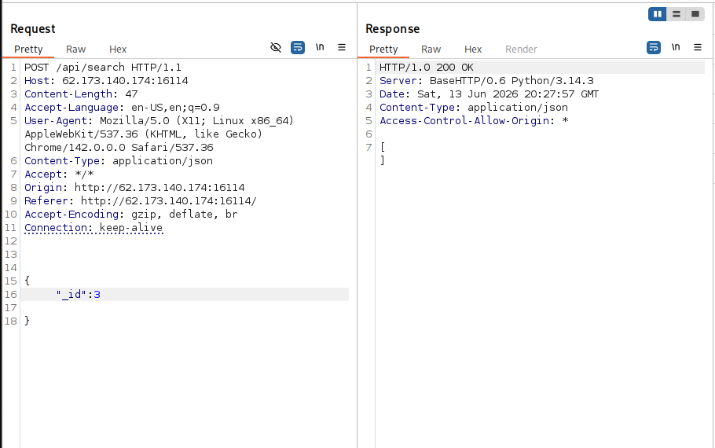
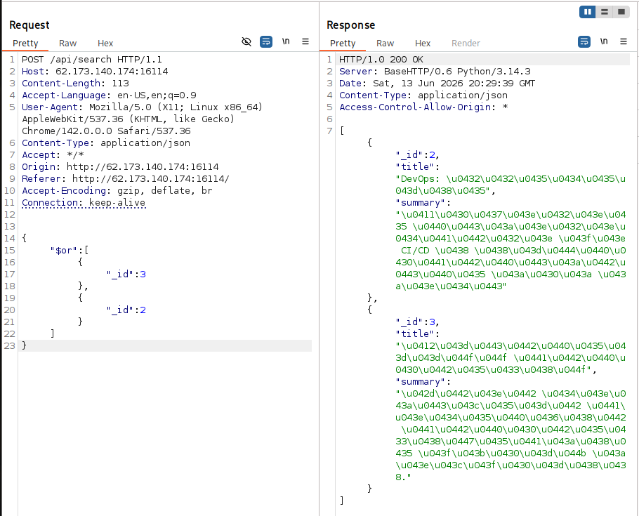
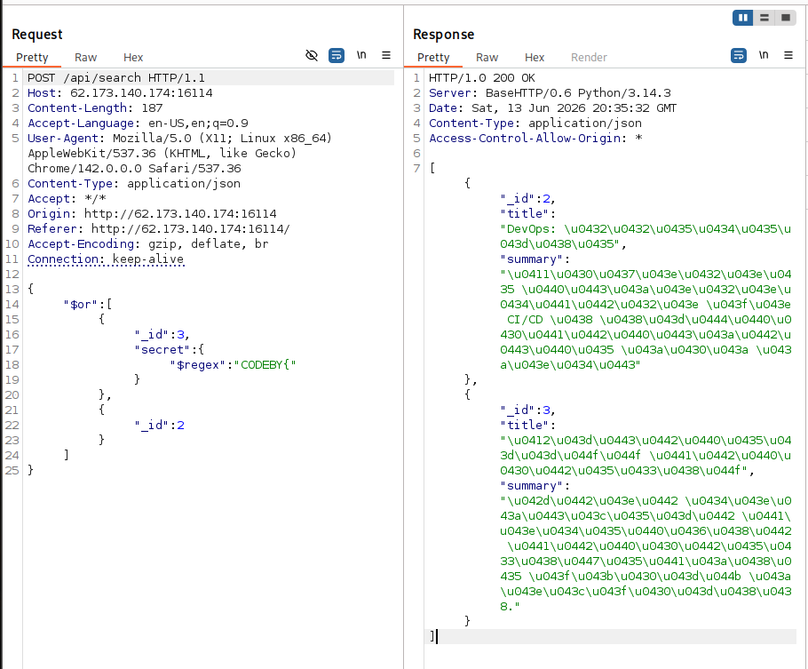
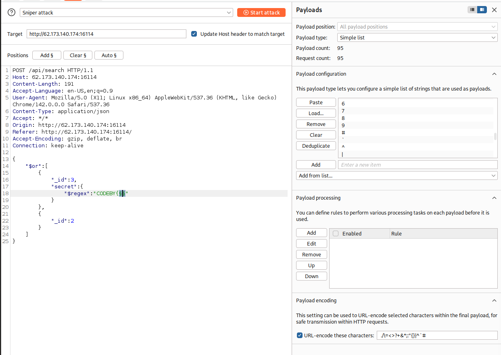
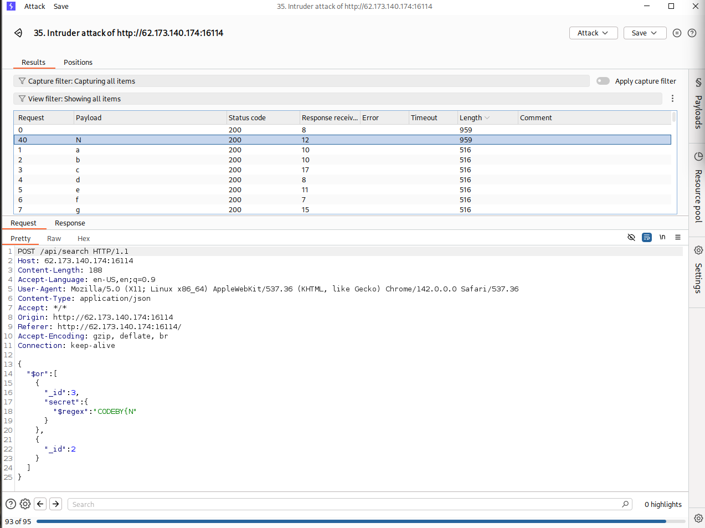
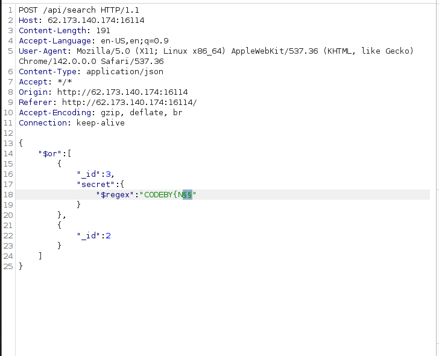

# Документальный архив Write Up CTF

Теперь все свои документы храню тут

Нас встречает поле ввода

Ничего не введём и нажмёт "Искать"\

Посмотрим запрос в Burp

Присутствуют три идентификатора: "_id", "title" и "summary"

Заметим, что пропущен "_id": 3

Попытаемся его вывести отдельно

При прямом обращении сервер не выводит

Воспользуемся оператором $or

Присутствует Broken Access Control. Сервер скрыл третий документ проверкой, которая ломается при использовании оператора $or

title: Внутренняя стратегия

summary: Этот документ содержит стратегические планы компании.

При поиске может будет у нас идентификатор "secret"? также сразу поищем флаг "CODEBY{", используя регулярное выражение

Запрос выполнился, значит можем через Intruder восстановить флаг по символьно

Добавив после CODEBY{  два $$ (для подстановки из payload list), не забыв добавить большие, маленькие, а также спецсимволы в payload list.

Отсортировав по параметру "Length", получим следующую букву "N". 

После подставляя каждую букву последовательно таким же образом получим флаг полностью

